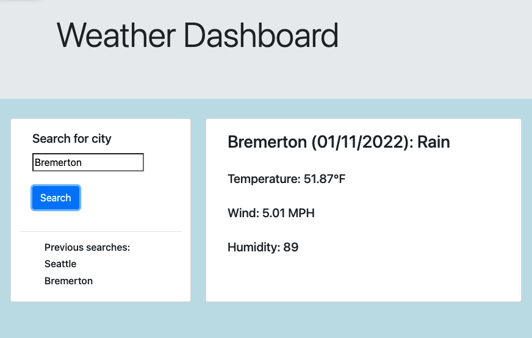
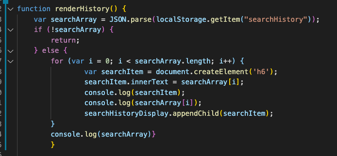
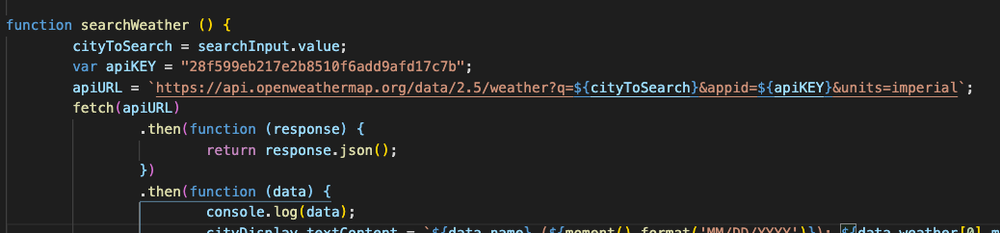

# About weather-dashboard

I used a combination of Bootstrap, DOM manipulation, local storage, and the Fetch API to make a page that obtains weather data from One Call API. A user can search a city and find the city's weather, temperature, wind speed, and humidity.

This was my first time retrieving an array from local storage. I did this to display the searches from the last time the page was opened. Using the JSON parse and stringify methods were essential to this method. I relied on previous activities for the syntax.

This assignment got me more comfortable with fetch requests, an API with no auth required, and understanding and using data from the response. I discovered that other parameters were needed to search the location by city and display the temperature in Fahrenheit. 

# Future features
-Weather icons
-UV index 
-Improved UI
-Five day forecast
-Clickable previous cities